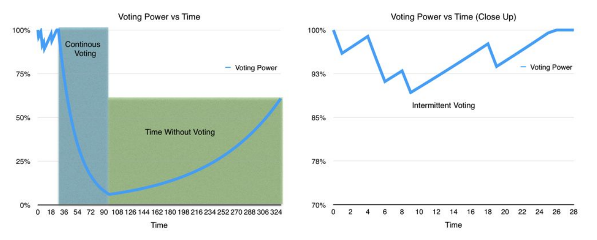
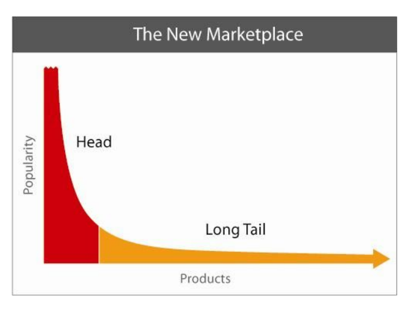

**Steem**

** 一个激励人心的、基于区块链的社交媒体平台 **

Daniel Larimer, Ned Scott, Valentine Zavgorodnev, Benjamin Johnson,James Calfee, Michael Vandeberg
2016年3月

中文翻译版由［somebody］(https://steemit.com/@somebody) 于2016年7月完成。

\newpage

# 摘要
Steem是一个通过提供加密货币奖励支持社区建设和社会互动的区块链数据库。Steem将社交媒体的概念与建设加密货币和社区过程中汲取的经验相结合。激励人们参与社区、货币和自由市场经济的关键一环是提供一个始终反映每个人贡献的公平会计体系。Steem是第一个尝试准确、透明地为无数对社区做出积极贡献的个人提供回报的加密货币。

\newpage

#目录

<!-- TOC -->

- [摘要](#摘要)
- [引言](#引言)
- [辨别贡献](#辨别贡献)
- [贡献方式](#贡献方式)
- [资本投入](#资本投入)
- [Steem（STEEM）](#steemsteem)
- [Steem Power（SP）](#steem-powersp)
- [Steem Dollar（SMD）](#steem-dollarsmd)
- [实现欺骗性输入最小化](#实现欺骗性输入最小化)
- [消除定时攻击](#消除定时攻击)
- [转换舞弊最小化](#转换舞弊最小化)
- [提现](#提现)
- [可持续债务与所有权比率](#可持续债务与所有权比率)
- [利息](#利息)
- [设定价格输入](#设定价格输入)
- [积极投入](#积极投入)
- [分配货币](#分配货币)
- [货币分配投票](#货币分配投票)
- [投票串通](#投票串通)
- [螃蟹桶的故事[6]](#螃蟹桶的故事6)
- [速度限制投票](#速度限制投票)
- [推迟偿还](#推迟偿还)
- [补偿分配](#补偿分配)
- [奖励父帖](#奖励父帖)
- [补偿](#补偿)
- [一致性算法](#一致性算法)
- [Steem共识](#steem共识)
- [Steem挖矿](#steem挖矿)
- [开发获得回报要求Steem Power](#开发获得回报要求steem-power)
- [挖矿算法](#挖矿算法)
- [抵御僵尸网络](#抵御僵尸网络)
- [抵御开发池](#抵御开发池)
- [消除交易费用](#消除交易费用)
- [费用问题](#费用问题)
- [微额付款失去作用](#微额付款失去作用)
- [费用是进入市场的壁垒](#费用是进入市场的壁垒)
- [改变费用](#改变费用)
- [女巫攻击](#女巫攻击)
- [完全预留与部分预留](#完全预留与部分预留)
- [带宽代替微额付款渠道](#带宽代替微额付款渠道)
- [应用实例](#应用实例)
- [案例研究：Bitcoin](#案例研究bitcoin)
- [容量的影响](#容量的影响)
- [独立用户的最大数量](#独立用户的最大数量)
- [费用比较](#费用比较)
- [账户创建](#账户创建)
- [证明最低余额](#证明最低余额)
- [调整准备金率](#调整准备金率)
- [费用的相对有效性](#费用的相对有效性)
- [租赁与购买与时间共享](#租赁与购买与时间共享)
- [性能和可扩展性](#性能和可扩展性)
- [Reddit规模](#reddit规模)
- [分配与供应](#分配与供应)
- [令牌创建率的影响](#令牌创建率的影响)
- [令牌创建率的影响大于比百分之九十](#令牌创建率的影响大于比百分之九十)
- [Steem的结算](#steem的结算)
- [STEEM的权力](#steem的权力)
- [没有微支付，自愿给小费](#没有微支付自愿给小费)
- [价值在链接中](#价值在链接中)
- [解决加密货币的载入问题](#解决加密货币的载入问题)
- [解决加密货币清算问题](#解决加密货币清算问题)
- [审查](#审查)
- [通过搜索引擎优化，解决根本事实](#通过搜索引擎优化解决根本事实)
- [向基于区块链的署名转化](#向基于区块链的署名转化)
- [用基于区块链的内容奖励更换广告](#用基于区块链的内容奖励更换广告)
- [结论](#结论)
- [引文](#引文)

<!-- /TOC -->
\newpage

# 引言

总的来说，用户生成内容已为社交媒体公司的股东们创造了上亿美元的财富，例如Reddit、Facebook和Twitter。**2014**年，**Reddit**假设，如果对每一个通过写日志、添加评论或进行投票向**reddit.com**[1]提供内容的个人奖励一份**Reddit**公司的公平股份，那么其平台将得到改进。Steem旨在通过向那些提供有价值贡献内容的个人回报大量价值，以加密货币的形式提供奖励，支持社交媒体和网上社区，并通过这一过程创造一种能够延伸到广阔市场的货币，囊括尚未参与任何加密货币经济的群体。

采用了若干关键原则来指导Steem的设计。最重要的原则是向企业提供内容的每个人应当收到企业按比例提供的所有权、付款或债务作为回报。这一原则与应用于所有启动公司的原则相同，因为都是在创立初期和随后的融资过程中分配股份。

第二个原则是所有资本形式都具有同等价值。这意味着那些提供宝贵时间和精力为其他人生成和策划内容的个人与那些提供宝贵现金的个人同样重要。这就是“劳力平等”[2]原则，是先前的加密货币在提供服务的对象稍微多一点时就常常遇到困扰的一个概念。

第三个原则是社区生产产品，为其成员服务。这一原则的应用实例包括信用联盟、食品合作社和健康共享计划，为社区成员提供服务而非向共享社区以外的人群出售产品或服务。

Steem社区向其成员提供以下服务：

1、发掘所策划新闻和评论的资源；

2、获得个人问题优质答案的途径；

3、提供与美元挂钩的稳定加密货币；

4、支持自由支付；

5、向其他成员提供以上服务相关的任务。

Steem有目的地重组经济激励机制，具有为相关的每个人产生比先前社交媒体和加密货币平台更公允、更兼容并包成果的潜力。本文将对现有的经济刺激机制进行探讨，论证Steem激励方式如何为大多数参与者带来更佳的成果。

## 辨别贡献

Steem的设计宗旨是应对妨碍以社交媒体为基础的经济体中信息采用和货币化的主要障碍。我们的主题是——用于发展主要社交媒体平台的技术同样可用于引导加密货币取得成功。加密货币实现的经济激励机制可以显著地促进新社交媒体平台的发展。这是加密货币与社交媒体之间的协同作用，我们相信可为Steem提供一个强大的市场优势。

Steem面临的挑战是推衍出对个人贡献内容进行打分的算法，能够得出大多数社区成员一致认同对每一个贡献内容主观价值的公平评估。在一个完美的世界里，社区成员相互合作，对彼此的贡献内容进行评定，得出公正的报酬。而在现实世界中，必须设计算法来抵御某些人故意操纵获益。任何普遍滥用评分系统的行为都可能造成社区成员失去对经济体系感知公平性的信任。

现有平台的运行原则是一人一票。这形成一个可以通过<巫攻击操纵排名的环境，服务供应商必须积极识别和拦截舞弊者。尽管仅有的回报是网站流量或网络审查，已经有人在企图操纵Reddit、Facebook和Twitter的评分算法。

Steem平台上帐户的基本单位是STEEM，一种电子密码货币代币。Steem的运行基础是一STEEM一票。在此模式之下，根据帐户余额进行计量，为平台提供内容最多的个人对贡献内容如何评分拥有最大的影响。此外，Steem致力于多年行权计划，仅允许拥有STEEM的成员投票。在此模式之下，成员拥有足够的财务激励以实现STEEM长期价值最大化的方式投票。

Steem的设计基于一个相对简单的概念：每个人向社区提供有意义的贡献应在其增长价值方面得到认可。只有在人们提供的有意义贡献内容得到认可时，他们才会继续做贡献，社区才能得到发展。社区内部的交换不平衡是不可持续的。最终给与者对支持获取者感到厌倦，就会脱离社区。

问题在于建立一个能够识别什么是需要的贡献内容、无数会员如何对相对价值进行评分的系统。

对贡献内容进行评估和提供奖励的一个可靠体系是自由市场。自由市场可以看成是一个单独的社区，每个人彼此进行交易，通过收益与损失确定奖励。市场体系能够奖励那些向其他人提供价值的人，处罚那些消耗超过创造价值的人。自由市场支持各种货币，财富只是每个人便于交流的一件用品。

因为自由市场是一个被证实可靠的系统，吸引人们尝试创造一个自由市场经济，内容消费者直接向内容生产者支付。但是，对于内容生成和策划来说，直接付款是低效的，实际上也是不可行的。相对于进行付款伴随的认知、财务和机会成本来说，大多数内容的价值是极低的，很少有读者愿意给钱。丰富的免费替代方案意味着实行“付费门槛”将把读者赶往其他地方。也存在过一些执行读者向作者按条微额付款的尝试，但并没有广泛流传。

Steem的设计目的是通过改变经济方程式实现所有类型供稿的有效微额付款。读者不再必须决定自己是否希望从自己的口袋里向其他人付款，而是对内容进行投票，由Steem根据投票情况决定个人奖励。这意味着向人们提供一个熟悉的、广泛使用的接口，不再存在传统微额付款和打赏平台面临的认知、财务和机会成本问题。

来自社区成员的投票输入信息对于Steem向供稿人准确地确定支付十分关键。因此投票可以视为一项关键的贡献内容，本身就值得奖励。有些平台，例如Slashdot，采用变化审核[3]作为对诚信审核者进行排名和提供回报的方式。Steem选择向那些为一篇内容的全部增益做出最大贡献的会员提供回报，对投票人的奖励与向内容创建者支付的最终回报成比例。

还有一些Steem使用目标指标识别和奖励供稿的其他形式。这些方式包括：交易确认、工作开发证明、提现奖励和舞弊者报告。

\newpage

# 贡献方式

本节概要说明了Steem背后的概念以及对那些向Steem社区提供有意义的、可计量贡献内容的会员进行奖励。

## 资本投入

社区可用来吸引资本的有两个方面：债务和所有权。购买所有权的会员在社区得到发展时获得利润，但在社区收缩时面临损失。购买债务的会员能够得到有保证的定量利益，但不能参与社区发展实现的任何利润。对于社区发展和货币价值，两种资本投入方式都是宝贵的。此外，持有所有权有两种方式：变现和行权。所有权行权得到一个长期的承诺，在短期内不能出售。

Steem网络把这些不同的资产类别叫做“Steem”（STEEM）、“SteemPower”（SP）和“Steem Dollar”（SMD）。

## Steem（STEEM）

STEEM是Steem区块链上帐户的基本单位。所有其他代币的价值均从STEEM价值衍生出来。一般而言，需要提现时，应在短期内持有STEEM。希望进入或退出Steem平台的人必须购买或出售STEEM。一旦购买了STEEM，应转换为SP或SMD，以消除长期稀释的影响。

由于非SMD的刺激，STEEM常常每年增加100%的供应。持有STEEM而没有转换为SP的会员权益每天稀释0.19%左右。这个速度看起来可能有点高，然而针对小于10天的交易，仍然比信用卡手续费更便宜。此外，每天的代币生成速度与价格波动率相比是微不足道的。

购买Bitcoin或任何其他加密货币的个人在10天后出售，由于价格波动，很容易发生3%甚至更大的损失。购买Bitcoin然后在同一天出售的，一般要支付0.4%以上的市场费用。换句话说，典型会员持有STEEM期间，发生的STEEM通胀率事实上是微不足道的。

大部分通货膨胀事实上是人为会计的因素导致的，而非财富的真实再分配。90%的非SMD通货膨胀分配给现有的STEEM持有人，与SP结余的STEEM价值成比例，使得通货膨胀看起来更是一种“分裂”。仅有10%左右的非SMD通货膨胀对网络中的所有权进行再分配。

## Steem Power（SP）

启动公司要求获得长期的资本承诺。那些将自己的财富投资于启动公司的人们估计要等待好几年才能出售手里的股份，实现获利。如果没有长期的资本承诺，启动公司寻求通过出售增发股权筹集更多资本，这将与心生退意的现有股东形成对抗。机智的投资者希望把资本投入到公司发展中，但新增资本落到期待退出的股东手里，公司仍然不会得到发展。

拥有长期承诺是十分重要的，因为这能够促使社区制定长期计划。利益相关者的长期资本承诺也引起他们对长期发展投票，而非成为短期的资金泵。

在加密货币空间里，投机者从预期拥有短期发展的一个加密货币到另一个加密货币不断变换。Steem想要建设一个主要由持有长远观点的人们拥有和完全控制的社区。

因为Steem希望鼓励长期发展，固定向Steem Power（SP）利益相关者持有的每1 STEEM配置9 STEEM，通过投入激励机制形成资金增长。久而久之，这将驱动SteemPower结余的STEEM总价值与STEEM总结余的比率趋向9:1。（似乎很可能的是，由于新印STEEM净额的持续增加，这个比率将稍微大于9:1。）这也意味着长期持有人能够得到保护，几乎完全避免资金增长导致的稀释。

SP只能在 2年后通过104同等每周支付转换回STEEM。“1SP”可以视为STEEM池中的一个股份。网络自动向池中每个区块增加STEEM。在任何时候，用户都可以将行权池中的STEEM以与全部SP相同的比率转换为SP。将STEEM转换为SP不会对现有的SP持有人形成稀释。同样，每次SP转换回STEEM时，均采用现行比率。个人得到的是在将来拥有比首次从STEEM向SP转换时获得更多STEEM的保证。

SP结余是不可转让、不可分割的，通过自动递归转换请求的除外。这意味着SP不容易用于加密货币兑换交易。

SP是一项关于投票与内容的要求。这意味着SP是在Steem平台内部向持有人授予专有权力的代币。

从STEEM向SP转换称为“提升权限”，而从SP向Steem转换称为“削减权限”。例如，会员可以在两年时期后削减STEEM权限，但随时可以立即提升STEEM权限。

## Steem Dollar（SMD）

稳定性是全球经济成功的一个重要特征。如果没有稳定，全世界的每个人都不能获得较低的认知成本，而是忙于怎么做生意和省钱。因为稳定性是经济体取得成功的一个重要特征，Steem Dollar的设计目的是为加密货币圈子和使用Steem网络的个人带来稳定性。

Steem Dollar的建立机制与可兑换货币类似，常常用于基金启动公司。在启动公司圈里，可兑换货币是短期的债务工具，可以按照将来确定的比率转换为所有权，而这个比率一般在未来筹资活动中确定。以区块链为基础的代币可以视为社区中的所有权，可兑换纸币可以视为以任何其他商品或货币标定的债务。可兑换纸币的条款条件允许持有人以代币的最低公平市场价格转换为基础代币。建立可兑换代币的币值使区块链能够发展网络影响力，同时实现代币持有人回报的最大化。

Steem Dollar被称为“符号SMD”，即Steem Dollar的简称。建立SMD要求综合可靠的价格输入、防止舞弊的规则和提现机制。提供可靠的价格输入涉及三个要素：实现不正确输入影响最小化、实现不正确输入成本最大化和实现时限重要性最小化。

### 实现欺骗性输入最小化

SP持有人推选的特定个人公开价格输入。这些被选举出来个人受到输入质量中既得利益者的全体信任。通过向当选者付款，Steem形成市场竞争，博得产生输入的权力。输入提供者获得的付款越多，他们就更确定会因假信息而受到更多损失。

假设有一组受到信任的当选输入提供者，可以推衍出用于转换的实际价格，用作输入的中值。这样，如果有少数的个人输入提供者产生非正值，他们对实际中值的影响极小，实际中值仍然拥有可信的能力影响。

即使所有输入提供者都是诚信的，可能大多数的输入提供者受到超出他们控制的事件影响。Steem网络设计容许短期对中值价格输入存在不良影响，同时社区积极工作纠正问题。可能需要花时间来纠正的一个问题是短期市场操纵。市场操纵是维持长期稳定的障碍，会造成巨大的代价。另一个例子是未能集中交易或交易发布数据的不良影响。

Steem利用一个星期内的中值价格消除短期价格波动的影响。每小时整点对输入公布的中值进行取样。

只要价格输入的不良影响持续时间小于移动中值时间窗口的一半，对转换价格的影响就是极小的。如果输入受到影响，网络参与者还有机会在受影响输入对实际转换价格发生影响前投票否决不良输入提供者。也许更重要的是，这给输入提供者提供了一个在输入开始对价格发生影响之前发现和纠正问题的机会。

在一周窗户中，社区成员拥有三天半的时间来响应即将到来的任何问题。

### 消除定时攻击

市场参与者有机会获得信息的速度比区块链一星期移动中值转换价格的反应更快。这一信息可用于为交易者营利，代价是损害社区利益。如果STEEM价值突然增长，交易者可以请求以更低的旧价格转换SMD，然后在极小的风险下以更高的新价格出售自己收到的STEEM。

Steem要求所有转换请求推迟一个星期，以此来平衡游戏圈子。这意味着交易者和区块链在执行转换时都没有关于价格的任何信息优势。

### 转换舞弊最小化

如果人们可以自由地进行双向转换，那么交易者可以利用区块链转换速度进行大量交易而不改变其价格。那些能够看到价格大大抬高的交易者将以高价转换成SMD（当时是最冒险的），然后等到纠正价格之后再转换回来。Steem协议保护社区避免发生这种类型的舞弊，仅允许人们从SMD向STEEM转换，禁止反向操作。

区块链决定如何、何时生成SMD以及谁将获得生成的SMD。这能够维持稳定的SMD生成速度，消除大多数的舞弊途径。

### 提现

正是由于SMD可以在合理的时间内按合理的价格转换为STEEM现金价值，并不意味着可以把它看成是可靠的现金替代品。这些资产要求在市场中提现，STEEM和SMD之间能够实现即时转换。区块链必须采取能够阻止可兑换现金质量下降的防舞弊措施。为了补偿这一质量损失，区块链可以向提现供应商提供一个固定的成本回报率。鉴于存在极大可能性发生由于操纵和舞弊导致的损失，鼓励提现的成本是固定的。

提现供应者购买并出售SMD和STEEM。他们承担大部分的短期价格风险和长期输入风险，向其余的市场参与者提供优质的、极易变现的市场进行交易。

Steem拥有SMD和STEEM之间的区块链市场。用户可以通过向这一市场的交易双方提供提现博得奖励。区块链利用简单的算法对每一个用户的提现供应和消耗进行排序。

如果用户在登记册上未执行委托停留时间至少达到1分钟，而委托最终得到执行的，则视为提现。如果委托在得到执行之前撤销的，那么该用户不获得提供提现的奖励。

用户必须在有资格获得奖励的登记册两侧提供提现，必须始终提供提现。评分算法如下：

提现点数=净报价量×净询价量

如果拥有最多提现点数的帐户在一小时内收到1200 STEEM，那么其拥有的提现点数归零。一周以内没有收到任何提现点数的帐户也将其点数归零。这意味着无论你是提供大量提现还是长时间提供少量提现，每个人都将获得成比例的奖励金额。如果净报价量或净询价量为负数，那么提现点数视为0。

### 可持续债务与所有权比率

如果一个代币视为整体代币供应系统中的一份所有权，那么代币可转换现金视为债务。如果债务与所有权的比率过高，那么整个货币都可能变得不稳定。债务转换可能突然地增加代币供应量，反过来，在市场上抛售会压制价格。随后发起的转换要求发行更多代币。如果任其发展，系统可能崩溃，留下没有价值的所有权支持如山般的债务。更高的债务-所有权比让新的投资者变得不那么乐意拿出新的投资。

Steem每生成1个SMD，同时生成19.00元的STEEM，转换为SP。这意味着市场稳定后可能的最高债务-所有权比为1:19或5%左右。如果Steem的价值下降50%，那么该比率可能上升到10%。STEEM的价值下跌88%，可能造成债务-所有权比达到40%。假设STEEM的价值最终稳定下来，债务-所有权之比自然退回到5%。

保持保守的5%债务所有权比背后的概念是，即使所有债务都进行转换并出售，仍然有足够的购买者，对代币持有人的有效稀释程度仍然相对较小。

STEEM价值的急剧变化可能极大地改变债务所有权比率。用于计算STEEM生成百分比下限的根据是供应量应当包括所有未偿付SMD和SP的STEEM价值（根据现价/输入确定）。

### 利息

SMD向持有人支付利息。由公布价格输入的同一人设定利率，因此能够适应不断变化的市场情况。所有债务都向贷款者传递风险。持有SMD而没有赎回的人事实上是在以现金价值的形式向社区放贷。他们相信在将来的某个点上，将有人愿意以现金购买SMD，或者将有投机者和投资者乐意购买他们转换的STEEM。

STEEM和SP在社区成员愿意持有SMD时获得杠杆率。这一杠杆率能够放大增长的收益，同时也起到促进增长的作用。STEEM持有人在价格下降时会由于稀释变大而受到损失。加密货币项目显示，由于愿意信任网络投入资本的用户基础增加，获得收益最终增长的网络价值超过了下行过程中可能发生的任何稀释。

### 设定价格输入

精明的读者将认识到，限量供应的孽息资产交易价格可能高于或低于基础资产，取决于同一资产博得利息的其他机会。向美元挂钩资产支付高利率，很多人将哄抬Steem
Dollar的限量供应价格，直到价值低于1美元。在经济中，有一条原则叫做“三元悖论”[4]，说的是无法同时拥有以下所有三个条件：

1、稳定汇率；

2、自由资本移动；

3、独立金融政策。

如果Steem输入提供者的目标是拥有独立的金融政策，允许其创造和消灭Steem Dollar，同时完全控制利率，那么将会遇到许多问题。“三元悖论”说，Steem Dollar要么需要限制资本移动，导致现金汇率不稳定，要么放松对利率的控制。

Steem输入提供者最关注的是维持SMD和美元（USD）之间稳定的一对一转换。在任何时候SMD持续以超过1.00美元的价格交易时，必须停止支付利息。如果在债务利息率为0%的市场中仍然要求溢价的话，那么可以肯定地说，市场愿意扩大信贷，而非社区愿意承担债务。如果发生这种情况，SMD的价值将超过1.00美元，如果不收取负利率，那么社区什么都干不了。

如果债务所有权比率低于10%，且SMD以低于1.00美元的价格交易，那么应提高利率。这将鼓励更多的人持有SMD，力挺价格。

如果SMD以低于1.00美元的价格交易，债务所有权比率超过10%，那么应向上调整输入，每1 SMD提供更多的STEEM。这将增强对SMD的需求，同时也降低债务所有权比率，SMD回归美元平价。

假设STEEM的价值增长速度比Steem生成新SMD更快，那么应保持债务所有权比率低于目标比率，提供的利息将给每个人都带来利益。如果网络的价值进入平台或下跌阶段，那么提供任何利息只会让债务所有权比率更糟糕。

实际上，输入提供者接受委托责任，设定金融政策，目的是保持与美元稳定挂钩。滥用这一权力可能损害STEEM的价值，因此SP持有人都明智地投赞成票，期望依据以上概括的规则调整价格输入和利率。

如果债务所有权比率居高不下，变得危险，市场参与者决定取消转换请求，那么应调整输入，提高STEEM转换为SMD时支付的费率。

改变利率政策及/或STEEM/SMD换算率任何升/贴水都是一个对长期平均误差的缓慢而慎重的响应过程，而非试图响应短期的市场条件。区块链向提现供应商支付的是吸收短期要求提供服务的报酬。

我们相信，这些规则将给市场参与者带来信心，他们持有以1.00美元的价格购入的SMD不太可能亏本。我们信心十足地预期，在大多数的市场条件下SMD的成交价格处于0.99美元到1.01美元之间的较小幅度范围内。

## 积极投入

“主观工作证明”提供了向那些改进完全客观“工作证明”系统（例如开发）分配货币的替代方案。应用货币执行主观工作证明远远比任何客观工作证明系统更广泛，因为它们可用于围绕任何拥有充分定义目的的概念建造一个社区。个人加入社区时，买进一个特定的信念集合，可投票巩固社区价值或目的。

实际上，用于评估工作的标准是完全主观的，其界定在原始码本身以外。有的社区可能希望给艺术家带来回报，有的希望回报诗人，而有的希望回报喜剧演员。有的社区可能决定回报慈善事业，或者帮助推进政治议程。

每一种货币实现的价值取决于特定社区内部对影响力的需求和大市场如何相信社区能够实现这个需求。不同于先前的系统，主观工作证明能够使社区获得共同融资，对其认为有价值的任何项目进行发展，使先前货币化的能够获得非货币化时间。

### 分配货币

人们参与加密货币社区有两种方式：买进或工作。在两种情况下，用户都可以增加货币的价值，但是，绝大多数的人拥有的闲暇比闲钱更多。想象一下，货币在一个缺乏实际现金但时间极多的贫瘠社区如何实现自我发展的目标。如果人们可以通过相互工作挣钱，那么他们将利用公平会计体系/货币系统推动的相互交易促进价值增长。

向尽可能多的人以普遍感知公平的方式分配货币是一项很有挑战性的任务。可以通过客观的电脑算法进行完全评估的任务天性受限，一般而言，限制了积极的外部效益。在Bitcoin式开发的情况下，可以生产专门的硬件，促使人们投资时间，发展更有效的算法。甚至可以有助于发现质数，但这些东西在整体上都不能向社会或货币持有团体提供有意义的价值。更重要的是，规模经济和市场力量将阻止个人而非专家参与这种分配。最终，基于计算的开发仅仅是买进的另一种方法，因为要求现款支付电费或开发完成工作必要的硬件。

为了向每个人提供均等的介入机会和获得货币收入，必须向人们提供参与工作的机会。问题是如何判断提供服务的个人工作相对数量和质量，据此有效地向数百万计的用户分配奖励。这要求引入可扩展的投票流程。尤其要求必须尽可能分散调拨款项的权限。

向数百万计用户提供奖励的第一步是承诺分配定额的货币，不考虑工作事实上完成情况怎么样或用户如何投票。这把问题从“我们是否应当付款？”变成“我们应当向谁付款？”，给市场发出的信号是将要分配财富，授予“投标”工作最多的个人。这与Bitcoin类似，承诺向找到最苛刻评论的任何人奖赏50BTC。和Bitcoin一样，必须先于支付完成所有工作，而非向承诺将来工作的任何人支付风险奖励。

下一步是向积极做事的每个人提供回报，即使在遥远的地方。通过对已完成的所有工作进行分级并按比例分配价值实现这一点。市场变得更有竞争性，就变得更难以（更高质量或数量）获得同等补偿。

### 货币分配投票

假设财富分配定额，而且那些拥有未来价值和货币效用长期既得利益的人是必须决定如何配置的人。每个行权用户对谁的表现最好进行投票，在一天结束的时候，将当天可用财富按投票比例进行分配，因此一个人即使只有一份净赞成票也会获得奖励。

朴素的投票流程产生“囚徒困境”，每一名个体的投票者存在为自己投票的诱因，代价是损害更大团体的目标利益。如果每个投票者为自己投票，破坏了规则，那么最终将没有可分配的货币，货币总体上也不能带来网络效应。另一方面，如果只有一名投票者违反规则，那么该投票者将取得不应得利益，同时对货币的总体价值影响极小。

为了重组激励机制，阻止个人只给自己投票，必须以非线性的方式分配财富。例如，投票中的二次函数，即有人获得其他人两倍的投票，那么应当收到四倍的补偿，有人获得三倍的投票，那么应当收到九倍的补偿。换句话说，回报与投票的平方而非投票基数成比例。这反映了网络效应的价值，根据梅特卡夫定律，以参与者数量*n^2^*增长。

假设所有用户拥有同等的筹码，只收到自己投票的人将收到比其他获得100个不同用户投票的人少得多的利益。这鼓励用户对同样的东西合作投票，实现补偿最大化。这一系统也会产生串通的财务激励，如果每个人对同一人投票，然后在团体内部平均分配回报。

#### 投票串通

如果合作分配最佳工作的资金是想要的目的，那么应当实现串通可能性最小化，因为串通会拆墙脚，破坏这一目标。存在两种类型的串通，最简单的一种是一名用户仅仅购买比其他人更大筹码，而另一种涉及许多较小的利益相关者合作的协调关系。更大的利益相关者可以拥有100乃至1000名较小利益相关者的投票影响，这意味着他们拥有比在线性分布下大得多的诱因为自己投票进行舞弊。

不管任何一个人拥有多少钱，始终有很多其他个人拥有类似数量的财富。即使最富有的人也极少拥有远远超过其他几个名列前茅者的组合。此外，那些在团体中拥有大额投资的人也在试图与表决系统博弈为自己牟取利益的过程中遭受最大的损失。这类似于公司的执行总裁决定停止支付工资因此可以把所有利润装进自己口袋一样。每个人都会离开，为其他公司工作，然后不发工资的公司将变得分文不值，执行总裁最终面临的是破产而不是发财。

幸运的是，任何获得高度集中投票的工作也要经受最多推敲（通过宣传）。通过增加否决票，消除了很多较小利益相关者串通进行团体投票或较大利益相关者舞弊的可能。此外，较大的利益相关者在货币价值由于舞弊而下降时遭受的损失比为自己投票获得的利益更大。事实上，诚信的较大利益相关者可能在治理舞弊和利用反对票方面比较小利益相关者投票更卖力。

使用否决票让人们不会在系统中舞弊利用的是螃蟹思维，很多人在感知到某个人牺牲其他人的利益获利时都有这种思维定式。螃蟹思维通常指的是目光短浅的人胜过品行良好的人，因此这也允许品行良好的人胜过目光短浅的人。

螃蟹思维存在的唯一“问题”是人们有时会错误地相信有人以其他人的利益为代价获得个人利益。

#### 螃蟹桶的故事[6]

有个人在沙滩上散步，看到另一个人在岸边钓鱼，身边放着一个装诱饵的桶。走近之后，看到桶上并没有盖子，里面装了很多活的螃蟹。

“你为什么不盖上诱饵桶，免得螃蟹跑掉？”他问道。

“这个你就不知道了。”那人回答，“如果桶里只有一只螃蟹，它肯定会很快就能爬出来。但是，桶里有很多螃蟹时，如果有一只努力沿着桶壁向上爬，其余的会抓住它，把它拉下来，因此它也遭受与其余同伴们同样的命运。”

人类也一样。如果有人尝试做某些不一样的事情，获得更好的等级，提高自己，从自己的环境里逃出去，或者有远大的梦想，其他人就会尝试把她拖回来，也遭受与其余人同样的命运。

消除“舞弊”是不可能的，也不应当成为工作的目标。即使有些人试图“舞弊”，系统仍然能够工作。他们在舞弊或串通方面尝试成功获得的任何报酬至少在货币分配目的上与传统的Bitcoin开发采用的激活系统或通过开发池完成串通开发拥有同样的目的。所有必要的工作是确保舞弊不会变得猖獗，否则会破坏支持社区及其货币的实际工作诱因。

建设社区货币的目标是“在桶里获得更多的螃蟹”。采取严厉措施消除所有舞弊如同试图在桶上面放上盖子来防止有些螃蟹逃脱，代价是使得向桶里增加新的螃蟹变得更困难。只要让桶壁十分滑溜和给其他螃蟹足够的力量防止有的逃脱就足够了。

### 速度限制投票

实现舞弊最小化的主要部分是速度限制投票。个体用户每天只能读取和评价定量的工作项目。投票超过这个预定量的任何企图往往是自动操作和可能舞弊的标志。通过速度限制，投票更频繁的利益相关者每一张投票拥有的价值低于投票不那么频繁的利益相关者。尝试在多个帐户之间分配代币的企图也会分割影响力，因此不会导致影响力净增加，也不会分流对投票规定的速度限制。

--------------------------------- --------------------------
Voting Power vs Time              投票影响力与时间
Continuous Voting                 持续投票
Voting Power                      投票影响力
Time Without Voting               没有投票的时间
Time                              时间
Voting Power vs Time (Close up)   投票影响力与时间（收口）
Intermittent Voting               间断投票
--------------------------------- --------------------------

以上示意图显示了用户每次投票后投票影响力如何降低以及然后随着没有投票时间的推移逐渐恢复。示意图使用的是名义时间单位，可以度量任何目标投票速度。注意，在连续投票过程中投票影响力迅速下降，然后缓慢恢复。

投票影响力乘以用户行权代币，决定了应当向特定工作项目分配回报池中多少份额的行权代币。

### 推迟偿还

为了进一步防止舞弊，所有偿还从每一票的投票时间起推迟24小时，这是一个筹码加权平均值。这使得较大的利益相关者不能在最后一秒钟投票狙击偿还，否则其他投票人（亦称“螃蟹”）有机会打消可能的舞弊。一旦确定用户补偿，所有投票归零。如果补偿之后继续投票的，那么重新开始流程。

--------------------------------- --------------------
Change voting period expiration   改变投票的时间终止
Votes of expiration time          终止时间投票
Total votes                       总票数
Net votes                         净票数
Expiration                        终止
Time                              时间
--------------------------------- --------------------

此图示显示了投票时期终止响应新的赞成票和反对票如何发生变化。新的投票根据其相对于之前进行的所有投票按比例延长补偿期。在时间40小时左右，增加了许多新的投票，延长投票期12个小时，随后较少投票对投票期的影响少得多。

### 补偿分配

Steem奖励制度的主要目标是在网络上发起最佳讨论。Steem每年有10%的市场资本化价值分配给提交供稿、进行投票和讨论内容的用户。在Bitcoin的规格上，这可能达到每天向供稿人提供1
700 000美元的现金。

----------------------------------------------------------------------------------- --------------------- ------------

The new marketplace   新市场
Popularity            受欢迎程度
Head                  首部
Long Tail             尾部
Products              产品
----------------------------------------------------------------------------------- --------------------- ------------

实际分配取决于用户的投票模式，但我们相信绝大多数的奖励会分发给最受欢迎的内容。Steem强调投票后与Steem
Power投票量n^2^成比例的偿还。换句话说，投票量×将收到的成比例补偿如下：

投票\[×\]^2^/求和（投票\[0 …n\]^2^）

齐普夫定律[7]是说明现实世界中引人注目的现象存在意外范围的经验法则之一。这条定律讲的是，如果我们按受欢迎程度的规模对某个较大集合进行排序，集合中第二个要素是第一个尺度的一半左右，第三个是第一个尺度的三分之一左右，如此类推。一般来说，第k个项目是第一个尺度的1/k左右。

把受欢迎程度当作一个近似的价值尺度，然后根据齐普夫定律赋予每一个别项目的值。也就是说，如果我们拥有一百万个项目，那么最受欢迎的100个对总价值的影响占三分之一，接下来10000个也占三分之一，剩余 989900个占最后的三分之一。n个项目的集合价值与log（n ）成比例。

这一投票和补偿分配的影响是向良好的内容提供较大份额的赏金，而对尾部的较小参与者仍然提供奖励。

这导致的经济效应与彩票类似，人们往往高估了获得投票的概率，因此做的工作超过了获得奖励的预期值，从而实现社区服务过程中执行工作总数的最大化。每个人“中奖”的事实起到与赌场用来让人们持续赌博同样的心理作用。换句话说，小小的奖励有助于巩固可能获得更大回报的想法。

##### 奖励父帖

良好的讨论要求来回刷帖。你答复其他人时，他们获得你在该过程在收到补偿的50%。此规则适用于不超过6级深度。发起大型讨论会给父贴评论人带来极大的回报。

未能正确套用讨论中的帖子是取得投票的一个好方法。

这一诱因结构促使人们以推动其他人介入的方式供稿。它鼓励人们提出不易回答的问题，因此其他人可以提供有价值的答案。

### 补偿

一个帖子收到补偿时，包括50%的SMD和50%的SP。Steem Power向用户提供更多的投票权和交易权，而SMD以稳定的通货给用户提供直接利益。正如我们深入论述的，SP和SMD都专门设计用于鼓励长期持有而非短期出售的。

/newpage

# 一致性算法

一致性是社区对信息单元普遍认可、明确同意的方法。社会为达成有关谁拥有什么的一致性开发了很多算法。世界上每个政府都是一个基本的一致性算法单元，全体人员同意遵守组织中供奉的某一个规则集合。政府设立法院、法官和陪审员解释主观上的事实，得出最后的决定。在大部分时候，人们会遵守决定，即使这是错误的。

加密货币采用的算法是提供一种达成一致性的更好方法。公众总帐目中记录了来自个人的密码签名声明，建立全球事件的绝对序列。确定性的计算机算法能因此处理这一总帐目，得出一个普遍接受的结论。只要社区的成员对处理算法的意见一致，算法的结果就是权威性的。

主要考虑的因素是确定允许哪些声明记录到公众记录中。系统应当专门设计用于实现网络审查可能性最小化。对公众总帐目的网络审查与阻止某人对选择进行投票类似。在两种情况下，都能防止个体对全球一致性发生影响。

## Steem共识

在概念上，Steem采用的一致性算法与全世界公司采用的一致性算法类似。对Steem未来价值拥有既得利益的人们投票选出负责将声明纳入公众记录的个人。投票权重与每一个个体的既得利益成比例。

在加密货币的圈子里，公众记录一般被称为“区块链”。区块是指一组签名的交易。

在Steem中，区块生成是在环链中完成的。每一个环链包括21名推选出来负责建立和标志交易区块的证人。这些证人中有十九（19）名是通过赞成票推选出来的，一（1）名通过计算机操作取证选定，最后一名由前19名证人与总投票成比例的每个证人分时负责。21名有效证人在每个环链中打乱顺序，防止任何一名证人时常急略其之前生成的区块。

这一过程专门设计用于提供最佳可靠性，同时确保每个人拥有参与区块生成的可能，不管是否足够受欢迎获得投票名列前茅。人们拥有通过前19名当选证人执行审查制度的三个选择：与不在前19名的每个人一起耐心排队等待，购买足够的计算能力以比其他人更快的速度解决工作证明，或购买更多SP提高投票权。一般而言，应用审查制度是当选证人减少工作量的一个好方法，因此，这大不可能成为Steem网络上的一个实际问题。

因为有效的证人是事先已知的，Steem能够安排证人每隔3秒钟生成一次区块。证人通过NTP协议同步区块生成。这一算法的变型已应用于BitShares网络一年多的时间，被证实是可靠的。

## Steem挖矿

传统的工作证明区块链将区块生成与解决工作证明的问题结合起来。因为解决工作证明的过程要花费不可预测的时间，结果是区块生成时间也不可预测。Steem旨在拥有一致的、可靠的区块生成，每隔3秒钟生成一次，几乎没有可能发生差错。

为实现这一点，Steem将区块生成与解决工作证明分开来。开发者为Steem解决工作证明时，广播包含工作内容的交易。下一个计划证人将交易纳入区块链。交易纳入区块链时，开发者被加入到开发者预定生成区块的序列。针对每一个环链，从序列中弹出一个开发者，纳入证人活动集合中。开发者在生成计划的区块时获得付款。

工作证明的难度每增加一倍，序列长度就扩大4倍。因为开发者从每个环链的序列中弹出，每一个环链循环要花21×3=63秒，如果在21×3×4=252秒的时间里没有发现工作证明，难度自动减半。

### 开发获得回报要求Steem Power

第一个月之后，Steem开发者获得 Steem Power（SP）付款。SP通过两年期的“削减权限”程序实现偿付。这意味着开发者必须长时间等候，开发获得回报进行足够的削减权限，直到允许收回电力和计算资源成本，很可能要好几个月。削减权限程序妨碍建立开发池，因为池操作者必须将偿还款项分摊到数年的时间里。

在SP中支付开发回报的效应是防止开发者利用今天的价格决定开发的赢利能力。很少有人能够对未来价格取得一致意见。这意味着那些对未来价值估计最高的人会加大开发难度。对平台缺乏长期兴趣的开发者将在竞争中泄气。最终，这意味着开发所得不那么可能在市场上被清除，因为这一收入将随着平台中的长期粉丝阵营扩大而不断积累。

### 挖矿算法

Steem采用的开发算法要求开发者有机会使用接收回报帐户的专用密匙。这一要求存在若干重大影响。首先，它鼓励对Steem需要的椭圆曲线签名核验算法进行优化。其次，它使得建立开发池十分困难，因为池操作者必须共享对所有“匿名”开发者奖励的控制。第三，它使得难以使用僵尸网络，因为僵尸网络操作者必须向所有被攻陷主机分配专用密匙。

以下虚拟码说明了如何计算得出工作证明杂凑值：

设H=头块ID

设H2=SHA256（H+NONCE）

设PRI=生产者专用密匙

设PUB=生产者公用密钥

设S=SIGN（PRI，SHA256（H））

设K=回收公共钥匙（H2，S）

设POW=SHA256 （ K ）

### 抵御僵尸网络

僵尸网络阻止了很多工作证明货币的开发。僵尸网络集合了成千上万被黑客攻陷的电脑主机。这些黑客窃取被攻陷主机的计算机和电力资源开发加密货币代币。

Steem拥有许多防止这些计算机窃贼获取非法利益的资产。僵尸网络操作者唯利是图，一般会向出价最高者出售窃得的资源。这意味着那些利用僵尸网络支付计算能力的人使用与利用Amazon EC2的人相同的方式。Steem的行权要求意味着在购买僵尸网络资源上支出的资本在操作者面临价格波动的过程中长期处于繁忙。

阻止僵尸网络操作者获益的另一种方法是要求向所有被攻陷主机分配专用密匙。即使发现一台被贡献的计算机，操作者也可能损失货币。

最后的缓冲措施取决于时延。大多数的僵尸网络由因特网连接差的计算机组成，这些运行迟缓的因特网连接极大地降低了计算资源的有效性。

僵尸网络操作者使用资源从事其他活动比开发STEEM更有利、风险更低。

### 抵御矿池

开发者总共有3秒钟的时间接收一个区块，解决工作证明，把交易推进到下一个区块生成者。这个时间中有大部分由网络时延组成，意味着开发者网络连接良好十分关键，以最有效的方式使用计算资源。

由于时常发生头块变化和网络时延，向开发池中的参与者转发模板进行特殊区块开发进一步增加了网络时延，显著降低了建池开发的效率。

/newpage

# 消除交易费用

Steem不遗余力地向那些为网络做贡献的人们提供奖励。人们每次努力与社区进行互动时，如果原地打转或收费会起相反作用。

目前的区块链技术依赖交易费防止垃圾邮件。这些费用面临着与所有微交易相同的已知问题，那就是阻止区块链应用于低价值的交易。如果用户想要与集中式的替代方案进行竞争，完全分散的应用必须为用户提供免费交易的机会。此论文概要说明了Steem采用的消除费用必要性的方法，因此实现各种各样的先前站不住脚的分散应用。

##费用问题

区块链是向所有交易伙伴广播所有交易的分散式网络。不时产生的区块包括某个或所有在进行的交易。所有区块链必须找到阻止恶意用户以无价值交易消耗所有可用网络能力的解决方案。这些无价值交易可能阻止对其他有价值的交易进行处理，最终毁掉网络。

到现在为止，大多数区块链采用的解决方案是收取最低交易费用。价值几分钱的费用足以破坏成本高昂而无利可图的网络行为。同时，这种方法解决了垃圾邮件的问题，但它又产生了新的问题。想象一下，通过引入对每一封电子邮件收取小额费用解决垃圾邮件的问题；结果是人们不再使用电子邮件。

### 微额付款失去作用

收取交易费用的根本问题是导致微额付款失去作用，尤其是对于低价值的用户操作来说如此。向每笔交易收取费用时，它限制了分散式网络可能处理的交易类型。不管呼吁收费的意见如何有理，用户仍然厌恶对他们所做一切收费的体验。

想象一下，如果我们每天使用的网站向我们收费了，每览一次就收一次的费用，那么我们将修改帐户，改变密码。用户希望有些东西是免费的。要求用户做出行动是否值得小额费用的决定将产生焦虑，造成用户离开。

交易并不值得要求做决定，但如果决定是自动得出的，可能有一点点价值。无论多小，任何购买决定都涉及特定的焦虑，并不来自使用的接口或要求的时间，而是正是来自做决定这个行为本身。

和所有付款一样，微额付款要求进行对比：“这么多的*X*是否值得那么多的*Y*？”无法优化的这一事实会产生极小的思维交易成本，因为用户唯一的交易是自愿同意，而不是思考不发生任何成本的交易，没有成本就完全没有交易。

——克莱·舍基[8]

在财务支付圈子里，小额费用是可接受的，因为交易的价值相对于收取的费用是极高的，且买方已经决定购买。可能性区块链应用的圈子远远大于财务支付，包括很多用户完全无法接受费用的必要交易。

类似BitShares、Nxt、Ripple、Counter Party和Stellar的系统都允许用户设置区块链限价委托，都向用户收取一个很小的费用进行此项活动。稍后，如果用户希望撤消订单，再收取另一笔费用。类似Ethereum的系统把微额付款推上一个崭新的高度：根据计算结果收费。所有这些系统基于同样的理由努力吸引新的主流用户，如果Google对每个搜索项目都收取一笔很小的费用，那么分散的搜索引擎将设法从Google那里吸引用户。服务多么好并不重要，人们只是希望有些东西是免费的。即使用户最后在不同的费用结构下支付更大的综合费用，也会发生这种情况。

### 费用是进入市场的壁垒

任何费用都会对新用户进入市场产生壁垒。有人尝试Ethereum之前，他们必须取得某个ETH代币。希望在Ethereum上建设分散应用的任何人必须向顾客传递成本。购买电子密码货币不是一个很容易的任务，金额低于10美元基本上没什么用。这意味着希望尝试新分散应用的新用户必须首先被说服割舍10美元。

### 改变费用

久而久之，网络必须调整费用。由于代币价值增长或对其能力的冲击都可能发生这种情况。用户喜欢可预测的费用和有保证的服务。尽管在频繁使用的过程中能够动态调整费用，结果也会带来糟糕的用户体验。

### 女巫攻击

集中式网址能够通过速度限制和某种形式的ID审核阻止垃圾邮件。即使有些东西和reCAPTCHA一样简单，也足以限制假帐户的生成。如果有人滥用帐户，那么集中式网址能够自由阻止帐户。

在分散的系统中，没有直接的办法禁止用户，集中式供应者也不能够主持
reCAPTCHA对帐户执行速度限制。事实上，不能审查用户是区块链技术的主要卖点之一。

### 完全预留与部分预留

让我们把区块链看成互联网服务提供者（ISP）合作社一样，拥有镇上的所有电缆，在任何时候都可能提供最大的带宽。在镇上生活的人们可能购买ISP份额，在交换中有权使用一部分可用带宽。

ISP提供两个选择，运行“完全预留”或“部分预留”系统。在完全预留系统下，每一个用户只允许获得与其份额成比例的一小部分最大带宽。因为不是每个人都在同时使用网络，镇上网络将出现利用率显著不足的情况。

在部分预留系统下，个体用户可能在任何已知时间点使用比他们有权享有更大的带宽，只要不是每个人都在同时使用网络。运行部分预留系统存在的问题是在任何时候有太多的人想要同时使用网络就会发生拥塞。ISP需要一种方法在拥挤时段提供带宽优先权。在最极端的情况下，完全拥塞的网络必须回到完全预留系统。问题是设定正确的部分预留比。

## 带宽代替微额付款渠道

微额付款问题的解决方案是执行动态的部分预留系统。在此模式之下，区块链将在拥塞时间自动调整网络预留比。区块链将设定使用目标，为短期需求冲击留下足够的净空间。在冲击持续的任何时间，区块链能够降低最大按份额分配带宽。冲击过去之后，有了剩余容量，区块链可能缓慢提高按份额分配的带宽。

应当对个体用户使用的带宽进行适当长期的计量，允许用户根据时间安排他们的使用情况。用户往往喜欢同时登录做很多事，然后退出。这意味着他们的带宽在短期内可能大大高于较长时期内观察到的值。如果时间窗口拉得太远，那么预留比不能足够迅速地发生调整，以响应短期的冲击；如果窗口太近，那么密集使用也将大大影响到正常的用户。

在我们的估计中，计量用户平均每周的带宽使用率足够了。每次用户签署交易时，该交易要考虑到自己本身的个体移动平均。在用户移动平均数超过当前网络限制的任何时候，他们的交易会发生延误，直到平均值下降到网络限制以下。

### 应用实例

设B等于时间T的用户平均带宽。设W等于每周的秒数，设N等于T之后S发生的新交易。已知这一信息，区块链可计算出用户的新平均带宽如下：

Bnew = MIN（0，B \* （W­S）/W） + N \* S/W

Tnew = T + S

每一个用户有权享有的每周平均带宽如下：

设U=用户SP

设S=SP的总数

设R=1和Rmax之间的当前预留比

设C=证人设定的最大区块规模能力

设L=每周总区块数量

设M = C \* L \* R

配置= M \* U/S

用户有权享有的平均带宽为M×U/S。在交易促使用户平均值超过这一阈值的任何时候，他们不能进行处理，直到经过足够时间降低平均值。

网络可能提高预留比，区块在在任何时候小于目标容量的一半，在达到大半的任何时候进一步降低。用于调整R的算法专门设计用于迅速反应，降低出现需求冲击时的预留比，同时缓慢提高需求低时期的预留比。

最低预留比为1，应当计算得出最大预留比，防止较小的利益相关者消耗所有的可用带宽。如果谁也不使用可用带宽，那么预留比率可能增长，直到仅拥有1
个货币的一名用户能够处理每一个单一区块。

### 案例研究：Bitcoin

为了理解这一算法将如何对Bitcoin起作用，有必要基于实际使用率估算出预留比R的合理值。基于15
M BTC的总供应和400 K
BTC[10]的日常交易量，我们可得出Bitcoin的最低预留比为38。应用方程式，我们可计算出每个BTC允许的每周带宽（字节）如下：

设C = 1MB = 1024\*1024

设L = 1008 （每周区块数）

设R = 38

设S = 14000000 BTC（供应减去不活动货币）

设U = 1 BTC

CLR/S = 2869 字节每周，或每个BTC为5笔交易/周。

因为R = 38为预留比下限，CLR/S为允许带宽的下限。这个简单的案例研究表明，用户每周要求最多0.20BTC（写本书的时候超过80美元）进行一次交易。但是，这是一个宽松的上限，源于所有BTC平均活动的假设。情况不是这样的——拥有数十数百比特币的用户未必就会一周交易数十或数百倍！那些用户“应当”完成的“剩余”交易量将提高预留比，允许“回收”他们未使用的带宽提供给较小的用户。

上述所有估计都是保守的上限，假设货币和使用率以相对扁平的方式进行分配。实际上，频繁使用的大流量用户，例如交换机，拥有比轻量级用户远远高得多的货币使用率比率，反过来意味着实际的最小结余要求低得。

#### 容量的影响

区块链容量不封顶。互联网基础设施的良好技术能力让比特币区块大小增至10MB，从而将最低所需余额减少10倍。虽然比特币目前只支持每秒约3笔交易，但是替代方案能够实现每秒超过1000笔交易。这让我们的保守上限改变为0.0006BTC或约0.25美元，意味着持有0.25美元的账户将能够平均每周至少交易一次（并且因为我们正在使用一个相当宽松的上限，所以很可能是多次交易）。

#### 独立用户的最大数量

我们可以使用类似的数学方法,计算网络允许每周交易一次的最大独立用户数量，为：B\*W/T。T代表平均交易规模。这意味着，假设每位用户均拥有相等的余额，比特币能够支持约200万用户每周进行一次交易。

#### 费用比较

若假设某用户持有价值25美元的比特币，每周交易一次，每次交易费用为0.04美元，则他每年支付的交易费将超过2.00美元。该用户需在25美元的基础上赚取8%的回报率才能够收支相抵。无论如何，用户均有在区块链上持有资金的机会，因此，持有价值为25美元比特币的用户通过采用费率限制方法而非收费制做法，在一年内能够节省2美元。只需175美元，用户就可以每天交易，并且每年可节省14美元。

### 账户创建

Steem基于账户的系统，具有公众熟知的余额，简化了基于带宽的费率限制算法实施。若账户余额低于最低每周交易一次所需的余额，则账户无法进行交易。这意味着所有新账户的资金均不得低于最低余额。这也意味着希望进行小量交易的用户，只要持有一个具有较大余额的账户，就可以重新使用该账户。

若网络使用率高涨，则在低使用率期间创建的低余额账户可能将无法访问。通过向该账户转入较大的余额，就可随时收回这些资金。

为维护用户使用最低下挂账户数量的体验，所有新账户在开户时的余额均为每周交易所需最低金额的10倍。通过此方式，即使需求增长10倍，账户依然可用。

由于具有女巫攻击（Sybil Attack）的可能性，因而任何初始账户的余额均必须来自于创建账户的用户，而不是令牌创建。

### 证明最低余额

从用户价值而言，迫使用户保持最低余额的概念发乎自然[11]。任何运营企业的人均明白，每个用户皆有重要价值。企业会花费30-200美元来获取一个用户。有时，企业直接向用户付费，有时支付广告费，还有些时候甚至为了用户群而收购整个公司。公司获取用户后，经常给予用户许多免费服务，其目的只是为了长时间保留用户，以便通过其他渠道从用户身上获取利益。

Ripple使用的最小余额[12]与账户的资源使用呈适当比例，并要求新账户内的资金不得低于此最低余额。目前，此最低余额约为0.15美元，大于我们对允许用户每周至少自由交易一次的预估金额，0.10美元。

通过简单的最低余额要求流程，区块链可执行用户最低值程序。任何希望为区块链带来新客户的企业，均可为新用户账户预筹最低余额要求的资金，以便让用户进行交易。注册新用户需要相对较高的费用（1.00美元），这自然会迫使每个提供免费账户的人在区块链注册之前，审核每个账户的质量和独特性。

保持最低余额实际上等同于让用户针对余额可能赚取的利息支付交易费。最低余额只是一笔钱，能够让用户在相对短的时间内赚取足够的利息，以便支付交易费。

幸运的是，所需的最低余额可低至一美元，这是用户可以理解和接受的。失去利息的机会成本不会引起微费的认知成本，这对用户而言更容易接受。

用于为账户预筹资金的STEEM，就是使新账户获得权力（即，转化为Steem权力）。

### 调整准备金率

费率限制要求网络迅速调整准备金率，以减轻攻击者试图涌入网络的影响。假设攻击者具有一个较大的余额，比如说可用令牌的1%。若再假设该网络的目标为50%的利用率，则持续攻击应发现该用户的网络容量限制在25%，但前提是假设每个人均使用25%的容量。换句话说，最大的独立用户应永远不可能消耗目标容量的50%以上，除非他们拥有的SP超过50%。

假设我们使用200x的初始准备金率。基于部分储备金，这意味着持有1%令牌的人有权要求总额为最大区块尺寸2x的交易。为使攻击者的网络使用率下降到25%，准备金率必须跌至25x。这将导致每周交易一次所需的最低余额增长8x。

区块链可以建立一个响应费率，表明使用中的任何持续增加均可在短时间内（比如30秒）降至目标容量。试图发送垃圾邮件的攻击者中断普通用户服务的时间不会超过一分钟。

尽管准备金率必须迅速降低并且呈非线性以打击滥用，但准备金率上调应缓慢且呈线性。若在短短30秒种内，既上调又下调网络，则攻击者可以使网络脉冲。交易涌入现象应在30秒内得到纠正，然后花费一个小时恢复至攻击前水平。在此模式下，攻击者可能以每小时30秒或不到1%的时间内大量涌入网络。

若网络使用率低于50%，则储备金率必须有一个缓慢持续上升的压力，直到网络达到最高储备金率。最大准备金率决定了在短时间内涌入网络所需的最低注。

少于总令牌/（2\*储备金率）金额的任何用户，甚至将无法产生足够的交易来填补一个单独的区块。假设准备金率为200，这意味着任何持有金额少于0.25%货币的用户，无法创建足够的交易以延迟任何人的服务。

### 费用的相对有效性

为比较费率限制和费用的有效性，我们必须考虑两个系统如何对攻击者的故意网络涌入做出反应。在比特币区，一个持有10000美元的攻击者可以通过填充每个区块中断一整天的服务。但是在采用动态部分准备金率限制方法的情况下，同样的攻击者却无法中断任何一个独立区块。

若我们假定一个更为极端的情形，假设攻击者拥有所有钱币的1%，则我们推测该攻击者拥有6000万美金。此攻击者可以拒绝比特币区块链服务16年，除非挖掘者增加收费或容量。即使收费提高到每笔交易15美元，该攻击者仍然可以让网络涌入持续16天。

根据费率限制方法，若某人持有所有钱币的1%并意图涌入网络，则他可以在不到30秒的时间内实现目标。

### 租赁与购买与时间共享

当个人拥有一套房时，他希望有权免费使用房子。若一群人共同购买一套房时，则每个人均希望根据其所有权比例使用房子。基于费用的区块链就像是从业主处租住房屋，而费率限制就像是业主之间的分时房屋。

若房屋由多人拥有，则这些业主必须决定如何对房屋进行分时。某人拥有这套房屋50%的所有权，但每年只有一个周末使用房屋，则他可能希望在其未使用时间占用房屋的人向他支付钱款。这是一个基于收费的系统的思维。

在另一方面，拥有这套房屋50%所有权的业主推测此房的未来需求将会增加，因而能够出售其股份获取更多利益。除自住的房屋外，还拥有一套或多套房屋的业主均为房地产投机者。有此思想，他们靠增值盈利，而不是收取租金。

一份股份的价值取决于它能够给予业主的时间。拥有一所房子的1%，并且每年1个周末的使用权是股份最低值。但是，若半数股东从不使用自己的周末所有权，则每份分时的价值上升到每年2个周末。若这些不活跃的用户不选择出租未使用的时间，则分时的价值会降回至每年1个周末。若将这些未使用的分时出售给他人使用，则分时的价值将下降50%。除非收取的租金大于股份下跌的价值，否则分时业主将遭受经济损失。

使用该原理，我们可以推测，基于收费的系统对用户而言将更为昂贵或者对于集体业主而言利润较少。一个独立小业主可通过出租自己的小时间片获取利润，但前提是由其他所有分时业主承担费用。实际上，降低分时价值的费用由所有业主共同承担，而利润集中在决定出租股份的独立业主。

我们由此可以推断，不收取任何使用费的区块链即为最好的区块链。若将收取使用费作为费率限制的一种替代方法，则使用费应相当于购买足够分时并承诺长时间持有以获取一次使用权的金额。

换句话说，交易费应当等于每周交易一次的最小账户余额，并且应在当周结束时退还。假设最低账户余额为1美元并允许某人每周交易一次。若某人持有1美元的余额，希望同时执行5笔交易，则他必须在其交易前或交易后将余额增加至一周5美元。

理论上，用户能够借用所需股份的地方就能形成市场。在实践中，用户能够更为有效地购买和出售时分，以达到需要的使用率。换句话说，谈判微贷款的成本高于维持适合每周最高使用率的余额的成本。

交易的分散费率限制可以实现新类型的分散应用，但当每个应用使用均需要微支付时，此类分散应用不可用。这种新模型为应用开发人员提供了决定是否以及何时向用户收取交易费用的能力。

/newpage

# 性能和可扩展性

Steem网络是建立在Graphene之上，Graphene也是向比特股提供动力的技术。已公开展示Graphen能够在一个分布式测试网络上维持每秒1000多笔的交易。通过对服务器容量和通信协议的简单改进，Graphen可以轻易地扩展到每秒10000或更多笔交易。

## Reddit规模

Steem能够处理比Reddit更大的用户群。在2015年，Reddit的870万用户平均每秒产生23个评论[13]，平均每年每位用户产生83个评论。共有7300万个顶贴，平均每秒产生2个新贴。共有约70亿张投票，创造了每秒220张投票的平均投票率。总而言之，若Reddit在区块链上操作，则需要平均每秒能处理250笔交易。

为实现这一业界领先的性能，Steem借鉴了LMAX交易所[14]的经验教训，LMAX交易所能够每秒处理600万笔交易。其经验包括以下要点：

- 将一切数据保存于内存中。

- 将核心业务逻辑保存于一个单独的线程内。

- 将加密操作（哈希和签名）保存在核心业务逻辑之外。

- 将验证划分为状态依赖型和状态独立型检查。

- 使用面向对象的数据模型。

通过遵循这些简单的规则，Steem每秒能够处理10000笔交易，且无需投入大量精力进行优化。

鉴于英特尔近期推出的Optane™技术，将所有数据保存在内存之内正变得更具可行性[15]。通过将所有贴子保存于内存以便于快速索引，商品硬件可处理所有与单个线程内Steem有关的业务逻辑。甚至，谷歌也是将整个互联网的索引保存于RAM内。随着区块链技术的使用，为防止数据丢失而复制数据库至许多机器的做法已变得微不足道。随着Optane™技术的盛行，RAM将在保持持久性的同时变得更为快捷。换句话说，Steem设计用于未来架构，旨在扩大规模。

# 分配与供应

STEEM网络始于0货币供应，并通过工作证明以每分钟约40
STEEM的速率将STEEM分配至挖掘者，且每分钟还可创建额外的40
STEEM用于选择内容和策展奖励池（每分钟总共80
STEEM）。之后，网络开始奖励转化为SP的用户。此时，由于以下各种贡献奖励的组合效果，STEEM以每分钟约800
STEEM的速率生长：

** 贡献奖励：**

策展奖励：每区块1 STEEM或每年3.875%，以较高者为准

内容创造奖励：每区块1 STEEM或每年3.875%，以较高者为准

区块生产奖励：每区块1 STEEM或每年0.750%，以较高者为准

POW纳入奖励（在区块864000之前）：每区块1 STEEM（奖励每回合21 STEEM）

POW纳入奖励（在区块864000之后）：每区块0.0476TEEM（奖励每回合1 STEEM）或每年0.750%，以较高者为准。

流动性奖励：每区块1 STEEM（奖励每小时1200 STEEM）或每年0.750%，以较高者为准

** 权力奖励：**

STEEM权力奖励：对于上述奖励创建的每个STEMM，将9个STEMM均分给所有STEEM权力持有者。

** SMD操作：**

SMD奖励：由证人设置的APR创建SMD值百分比，并作为SMD支付给SMD持有人。

随后的供给率：现存总SMD可兑换的STEEM数量将随着供给价格的变化而变化。当STEEM的值（由供给测量）增长时，此变化是STEEM的有效破坏（"燃烧"）；而当STEEM值（由供给测量）下降时，此变化是STEEM的有效创建。

比例限制有效地保证了刺激奖励的意义不会随着时间的推移而减小，其目的是防止系统经历许多其他区块链增长模式的“速度碰撞”。在这些模式中，早期参与者高奖励推动的井喷式增长之后，随着持续下降的奖励跌至低于诱导新人加入的所需水平，将出现长期停滞。

这些分配和供应百分比常数的总体效果是（约）800 STEEM的每分钟速率能够有效保持一段时间（即STEEM的单位），但以百分比计算（即，当总供应越来越大时，800 STEEM成为一个越来越小的总供应分数）。当每分钟速率800 STEEM的各独立组成部分均达到各自基于百分比的下限时，每个下限均将此下降停止在其速率组成部分内。这也意味着，从长期来看，名义速率将从每分钟800 STEEM升至（时变，供应依赖型）所需的值，以维持贡献奖励恒定年增长率为10%，以及维持贡献奖励和权力奖励的综合效果的恒定年增长率为100%。整体效果是使每年STEEM的供应翻一倍（但是，如下节所述，若大多数用户获得权力，则双倍效果实际上是一个不转移所有权的“分割”）。

正如SMD节所述，受SMD操作的影响，整体供应图变得更为复杂，这可能会因随后的供给率和SMD奖励，导致STEEM的大规模创建或毁坏。也存在其他规模较小的复杂影响，包括无人认领的奖励（如错过区块奖励）、由于挖掘者在工作证明生产中所获运气所产生的谈论、以及挖掘者队列长度的变化影响（由于网络的总哈希动力变化所导致）。

## 令牌创建率的影响

初看，STEEM供应的100%年增长可能表现为过度通货膨胀和不可持续性。遵循货币数量论[16]的人甚至可以得出结论：STEEM的价值每月一定下跌5.6%。从无数真实世界例子中，我们可了解货币数量对于价值并没有直接和立竿见影的影响，但的确起到了重要作用。

因为90%所创建的全部STEEM被分配回SP持有人，导致每年有一个2:1的“分割”而不是真正的通胀。用于奖励贡献者的支出总费率是每年市值的10%左右，远远低于比特币在发行头7年所维持的费率。

就STEEM供应比例而言，为向特定用户或用户群支付奖励而创建新STEEM将会对其他用户的余额产生负面作用。若恰好90%的STEEM供应为SP所持有，则贡献奖励对SP持有人余额的负面作用将通过权力奖励的积极作用得到平衡；SP持有人获得更多的STEEM（名义价值），但其链百分比（就总供应量分数而言）保持不变。若低于（超过）90%的STEEM供应为SP持有，则两种影响仍然指向相反方向，但正面（负面）作用变大，并且这两种作用的总和将趋向于把SP余额拉向90%。这种“拉”并不意味着SP值必须长期保持在90%，因为奖励对象将（在某些情况下必须）把其STEEM放入SP，这意味着“拉”向90%并不是作为SP持有的STEEM供应比例的唯一作用。

从2008年8月至2009年1月，美国货币供应[17]从8710亿美元增长到17370亿美元，每年超过100%的增长率，在未来6年将继续以每年20%的速度增长。总而言之，在不到七年的时间内，美国的货币供应量已增长4.59x。与此同时，美元相对于商品和服务的价值按照政府价格指数[^18]已下跌了近10%。该真实世界的例子表明，供应只是价格的一个组成部分。

数字商品（如STEEM）的价格由供给和需求驱动。若新STEEM分配至长期持有人，则供应增长通过相应的持有需求被抵消。该供应变化的影响将推迟，直至未来某日长期持有人决定卖出。之后，在2年内分配卖出压力。

当长期持有人决定退出时，STEEM市场供应将增加，并推动价格下跌。当一个新的长期持有人决定购买STEEM并将其转换回SP时，此下降压力将会逆转。因此，我们可以得出结论，价格将主要受长期持有STEEM的需求变化的影响。

在虚拟STEEM供应的100%年增长之中，5%是Steem美元（SMD）的形式。SMD承诺会在未来创建美元STEEM价值，并且不会影响当前市场上的STEEM量。债务与股权比例的变化可能会影响STEEM的感知价值，但它并不会直接导致STEEM值下降。若Steem值随着时间上升，则STEEM量（在未来可能会创建）将减少，并且相应的“通胀”实际上并未发生。

总而言之，总“花费”Steem确实能够资助内容、策展、挖掘和流动奖励，金额相当于10%的APR或每月1.2%。通过对流动STEEM执行每月10%左右的负利率，同样的财富转移可以得到实现，且无需任何STEEM供应变化。

换句话说，可以通过对每次转移收取3%的费用（类似于信用卡）和通过拥有1%的日STEEM转移，得到实现。比特币网络转移[19]1550万中的400000 BTC（或每日2.5%）。

流动STEEM的目的是促进长期持有人之间的所有权发生改变。网络针对所有权的变化“收税”，以资助发展。通过每周自动出售SMD STEEM（由网络将SP转换回STEEM），几乎可以完全避免此转移税。持有STEEM的总时间将很短，以至于改变STEEM供应所产生的任何影响都将微不足道，仅大于波动和其他市场费用。

### 令牌创建率的影响大于比百分之九十

截至2016年5月1日，超过98.49%的STEEM均已转化为SP。这表明，需求将长期占主导地位。在此环境下，流动STEEM和SP均用于资助奖励。

在比特币生命的头2年，网络维持了一个超过100%的年通胀率[20]。在头5年，年通胀率超过30%，而在头8年，年通胀率超过10%。根据估算未来通胀的工具（包括Steem源代码），Steem相比之下将在1年后实现约12%的瞬时年率（不包括SMD操作的影响）。

### Steem的结算

STEEM的供应增加几乎是一个结算神器。避免对流动STEEM收取负利率的愿望创建了此结算神器。负利率将使兑换生命期复杂化，从而必须调整用户余额，以考虑STEEM（由存款所持有）回报的负增长率。完全映射区块链逻辑是错误的倾向，并且会将集成和应用复杂化。因此，STEEM已选择永远不向用户账户收取费用，而是增加供应。这实现了一个类似的经济结果，且无需因执行内账负利率而强迫大家接受STEEM存款。

增加供应的一个副作用是网络将要求不断提高结算精度水平。用于表示典型账户的平均所需比特数量将以每年1.3倍增长。只需10年，这一数字就将不再适合由JavaScript支持的53位精度或CPU支持的64位精度。随着时间的推移，涉及数量的幅度增长超越了人类规模和理解；此外，最不显著的比特具有的经济价值小到没有意义。

为补偿不断增加的精度，STEEM网络将执行一个每32,000,000区块的10：1“反向分割”（约3年）。此时，STEEM的所有余额均除以10，所有价格乘以10。数字兑换必须中断此时的交易，并更新账户余额和价格记录，以便反映恢复交易前的“反向分割”。

所有的舍入误差都将以本网络为受益人。由于舍入的原因，每项余额都可能损失达0.009 STEEM，但这一STEEM金额在经济上应可忽略。总体来说，所有SP持有者最多将损失0.009 STEEM。

# STEEM的权力

STEEM认识到，所有用户贡献（帖子和投票）的价值大于部分的总和。一条单独的评论几乎没有价值，但数以百万策展过的帖子价值几百万（甚至可能是数十亿）美元。一条单独的投票没有什么策展价值，但数十亿的投票却是非常有效的策展。没有策展的内容，其价值有限。鉴于本互联网的所有内容都不带链接，谷歌将难以提供有用的搜索结果。正是信息之间的链接，给予了重要的价值。

因为每个人都受益，所以每个人都应该支付。换而言之，没有任何个体用户应为任何事情支付，但是应该为能给他们带来Steem价值的所有事情进行支付。我们需要做的事情就是确定哪些用户贡献为社交网络带来了价值，而哪些用户贡献没有。

总体来说，Reddit用户每秒投票220次，且每秒产生23个帖子。Reddit的估值在五亿美元[21]到四十亿美元[22]之间，这意味着，每一个支持票和每一条帖子的价值在0.06美元至0.50美元之间，但前提是假设Reddit的价值主要存在于过去一年的活动价值。有人可能会说，Reddit大部分价值存在于过去一周内发生的可以极大增加新活动价值的近实时讨论中。今天哪里热闹大家就去哪里，而不是去年哪里热闹大家就去哪里。

## 没有微支付，自愿给小费

将加密货币整合到社交媒体平台的现有尝试，都专注于使用户彼此之间能够相互支付。许多服务都试图引进小费。该理论认为，如果我们把付小费这件事变得足够简单的话，就会有更多的人参与进来。其他服务试图让人们支付，以促进或提高他们内容的排名。还有一些人试图建立一个小预测市场，对一篇文章将能收到多少小费进行预测。

所有的这些方法的结果就是微支付。他们的唯一的区别就是谁在支付。但都处于微支付参与度不足的状态。在寻找激励内容时生产企业家太过于关注谁应该支付的问题而没看到显而易见的现实：每个人都从其他人的行为中受益，所以每个人都应该支付或都不应该支付，取决于你如何看待这件事。

STEEM完全绕过微支付，因为当用户对一个帖子投支持票时，社区为其支付。无论该用户是否对一个帖子投了支持票，同等数额的钱都会被支出，且费用不是来自于投票者。

对大多数人来说，做出经济决策所耗费的精力成为他们的参与障碍。

>在这个信息爆炸的数字时代，关于上网该访问什么内容我们每天已经面临众多选择，以至于我们必须做的每个附加决定都只会增加我们所面对的不确定性和焦虑感。微支付的支持者认为，简化的工具可以最大限度地减少微支付侵扰，并改善用户体验，但他们的观点只使决策过程产生了双重标准\[2\]。一个交易价值不足以同时保证一个决策的正确性，又保证交易价值低是因为自动决策所致。唯一让用户不用思考就会同意的交易就是那些不用他们付钱的交易，因此任何正值的微交易都因为需要用户决策而增加他们的心理成本。此外，心理交易成本实际上上升到低于某一阈值，会使微支付处于一个更不利的状态。例如，人们很容易想到今天复印一份报纸花费一美元，但读者要决定每篇文章或每个词的价值时，会面临更多的困难和焦虑。如果所有的在线内容都分解为不同组成成分，并在一个微支付系统里单独估值，这个难题只会复制并加剧。

- 微支付：一个可行的商业模式[23]

在STEEM里，微支付款项支付给内容制作人，但为该内容投票的人不用支付。相反，奖励的费用通过新的令牌支付。一个人可以加入本系统，投票向某人支付，然后带着比他们开始时要多的钱退出系统（假设Steem系统的市场估值保持不变）。换而言之，由STEEM提供的微支付解决方案提供的用户体验，与具有用户调节内容功能的很多广泛使用的网站相类似。

更进一步地说，Steem支付人们去思考谁应该支付！这种想法是具有革命性的。

## 价值在链接中

如果内容中的所有链接被删除，互联网将失去其绝大部分价值。它是网页之间的关联，使谷歌能在一千六百万个结果中确定最好的苹果派食谱。如果没有链接，Google能得到的唯一信息就是词汇的出现频率。

链接可以有多种形式，并随时间改变而调整适应。每次用户对社交网络上的内容投票，他们便增加了一个他们和内容之间的链接。这反过来会通过内容将用户链接内容制作人。网络具有的链接越多，信息就变得越有价值。信息的相关和有意连通带带来了价值。

社交网络可以通过最大限度地提高链接的数量和质量，最大限度地提高从一组内容中提取的价值。策展内容昂贵且耗时，而在缺乏链接时计算机几乎不可能访问。Steem奖励第一个发现并链接新内容的用户。

通过激励策展，Steem网络能够使用自动算法从大量内容中提取出最有价值的信息。

## 解决加密货币的载入问题

探究加密货币[24]并不容易。发现到并想尽快尝试比特币的人很快便知道，他们需要注册账号用于兑换，并使用信用卡或电汇为账号充值。如果你必须交钱和交付两种形式的身份证明，Facebook的普及率又将会怎样？

通过为每个人提供一种赚钱方式，即完成一个简单但有价值的任务，Steem解决了这个问题。这将有助于广泛地散布STEEM令牌。这对Steem非常有益，因为加密货币具有网络效应（即用户越多越有用；举一个极端的例子，假设如果Satoshi一直将100%的比特币据为己有，比特币将毫无价值）。

## 解决加密货币清算问题

一种货币很难使用或不可能卖出，就没有什么价值。得到价值1.00美元比特币的人，会发现把这些比特币卖出去的花费会超过1.00美元。所以他们必须创建一个兑换账户，执行KYC验证和支付费用。少量的加密货币如同人们不愿弯腰捡起的零钱。

商家为用户提供了一种让他们把加密货币迅速转化为有形商品和服务的方式。商家需要一种从属于他们自己的记账单位货币，通常为美元。使用一种不稳定的货币会引入重大会计开销。

如果货币能够增加他们的销售额，商家会接受任何货币。拥有一种稳定货币（如SMD）的庞大用户群，将为商家降低门槛。商家的存在通过为用户创造出口，让用户无须兑换就能退出本系统，从而改进了本系统。

另一种可让人们变卖参与Steem平台获得的少量加密货币的方式，就是通过给他人支付小费。这就好像留下零钱作为服务员的小费。当足够多的人留下小费时，这些小费加起来的总额就很可观。你和服务员都会从小费中获益。

## 审查

Steem是一种去中心化网络，由世界各个司法地区的挖掘者操作。所有用户操作都公开记录在区块链中，并且可以公开验证。这意味着，没有单一实体可以审查由STEEM持有人估值的内容。

个人网站如steemit.com可以审查其特定站点的内容，但在区块链上发布的内容本质上是广播流量，并且反映周围状况。世界会持续让其可用。

言论自由是所有其他自由的基础，任何对言论自由的侵犯都破坏了达成共识的唯一和平方式：讨论。如果没有自由，讨论投票者无法充分知情，且不知情的投票者对社会造成的威胁比失去投票权本身所造成的威胁更大。审查制度是通过限制公共话语来窃取选票的一种手段。Steem致力于实现言论自由，并建立一个自由的社会。

## 通过搜索引擎优化，解决根本事实

大多数加密货币对于不积极使用网络的人来说价值不大。相比之下，Steem会生成内容并鼓励用户进行共享。内容被搜索引擎收录，并最终给大量的被动用户带来价值。这种搜索流量为Steem网络创造有机广告并加强网络效应。

## 向基于区块链的署名转化

互联网是世界上最简单的信息传播媒介。不过，对希望拥有自己的内容，并将内容以适当署名分享出去的内容创作者来说，互联网是个可怕的地方。在现在的社交媒体平台上，署名是可以一夜之间就失去的东西
-发布的一个视频或一张图像可以未经创作者同意或未考虑创作者就被复制并再分享。

在基于区块链的社交媒体，创作者或作者总是能够出具公共记录和时间标记证明内容出处。在这种情况下，如果创作者想要定址这些未经许可或未注明署名就再共享的人，基于区块链的记录可提供公共证明，证明该内容由特定用户在特定时间发布。在未来，基于区块链的署名会因其可靠性而逐渐受到各国政府的认可，并能在法庭上有一定分量，这将使内容创作者有更大权力来管理他们的作品。

虽然时间标记服务几乎可以建立在任何区块链上，并且为了在比特币网络上建立这种服务已付诸了一些努力，但是因为内容发布者是“一等公民”，所以Steem在这个领域有一个有用的优势--Steem区块链完全围绕发布内容的使用情况而建造，这使得内容创作者可以仅仅通过使用与其他Steem用户相同的创作工具写作他们的帖子，用区块链验证他们在某一特定时间点创作的内容。

## 用基于区块链的内容奖励更换广告

在大多数内容货币化模式中，内容创作者会利用这种或那种形式的广告。许多创作者认识到广告可能会降低作品带给用户的价值，但创作者往往必须通过货币化寻求时间回报。广告是一把双刃剑：通过广告，创作者可以容易地赚钱。如果没有广告，货币化难以实现，但内容却更丰富。

创作者发帖到Steem关联的社交媒体渠道上，只有作品获得Steem社区认可(或者“被喜欢”），才有可能会获利。基于区块链的付款完全数字化，并且没有中介。因此，通过基于区块链的内容奖励进行的货币化应该会更快，并且与通过广告进行的货币化相比，使用门槛更低。

/newpage

# 结论

Steem是一个实验性平台，旨在通过结合加密货币和社交媒体行业的优势面，应对这两个行业的挑战。Steem以社交媒体行业从未使用过的方式，把挣钱的机会提供给内容创作者和互联网读者。在Steem上，个人在线赚得的真实奖励直接与他们的贡献相关。基于市场价格发现和Steem的流动性，奖励将具有美元的价值，并且Steem持有人会比非持有人拥有更多的独家盈利权力。

\newpage
# 引文

[1]:http://www.forbes.com/sites/erikamorphy/2014/10/01/reddits-cryptocurrency-could-have-many-uses/\#4e07b05332b9  “《Reddit加密货币》，《福布斯》，埃莉卡•墨菲，2014年10月”

[2]:http://www.investopedia.com/terms/s/sweatequity.asp  “《劳力平等》，《投资百科》“

[3]:https://en.wikipedia.org/wiki/Meta-moderation\_system “变化审核是一种二级评论审核。邀请用户对审核者的判断进行评定，目的是提高审核可信度。”

[4]:https://en.wikipedia.org/wiki/Impossible\_trinity  “三元悖论，《经济理论》”

[5]:https://en.wikipedia.org/wiki/Metcalfe%27s\_law “梅特卡夫定律”

[6]:http://guidezone.e-guiding.com/jmstory\_crabs.htm ”《螃蟹桶的故事》“

[7]:https://en.wikipedia.org/wiki/Zipf%27s\_law “齐普夫定律”

[8]:http://www.openp2p.com/pub/a/p2p/2000/12/19/micropayments.html “克莱·舍基，微额付款案例”

[9]:https://www.google.com/recaptcha/intro/index.html ”reCAPTCHA，宽以待人，苛求机器”

[10]:https://blockchain.info/charts/estimated-transaction-volume?showD “Bitcoin估算交易量”

[11]:http://www.forbes.com/sites/tristanlouis/2013/08/31/how-much-is-a-us “Forbes，Tristan Louis，一个用户的价值为多少？”

[12]:https://ripple.com/build/reserves/ “Ripple，账户储备”

[13]:http://expandedramblings.com/index.php/reddit-stats/2/ “Reddit统计数据、每秒的用户和评论数量”

[14]:http://martinfowler.com/articles/lmax.html “Martin Fowler, LMAX 架构”

[15]: https://newsroom.intel.com/press-kits/introducing-intel-optane-technology-bringing-3d-xpoint-memory-to-storage-and-memory-products/ ”引进英特尔Optane 技术- 将3D XPoint内存引入存储和内存产品“

[16]:http://www.investopedia.com/articles/05/010705.asp ”货币的数量论“

[17]:https://research.stlouisfed.org/fred2/graph/?s%5B1%5D%5Bid%5D=AMBNS “美国货币供应量，2009年”

[18]:http://data.bls.gov/cgi-bin/cpicalc.pl?cost1=1&year1=2008&year2=2016 “CPI通货膨胀指数,美国美元 2008-2016”

[19]:https://blockchain.info/charts/estimated-transaction-volume “比特币交易量”

[20]:https://bitcointalk.org/index.php?topic=130619.0 “比特币的年通货膨胀率，比特币论坛”

[21]:http://www.newsweek.com/investors-think-reddit-worth-500-million-26 ”Reddit估值，新闻周刊，2014年“

[22]:http://www.worthofweb.com/website-value/reddit.com/ ”网站价值，2016年3月“

[23]:http://cs.stanford.edu/people/eroberts/cs181/projects/2010-11/Microp “微支付：一个可行的商业模式”

[24]:http://www.dailydot.com/opinion/bitcoin-cryptocurrency-adoption-hard “Dailydot, Jon Southurt，2015年4月”
